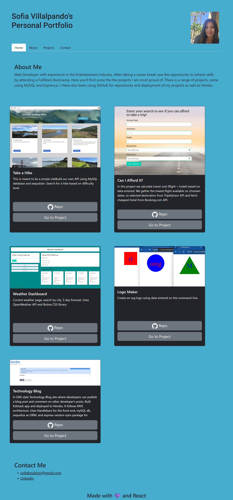

# React version of my Portfolio

## Description

This project is a personal portfolio of different projects I have worked on. It includes my name and a recent photo. There are navigation links to a section about me, my work, and how to contact me. Project samples include an image, title of the project, a short description and buttons to repo and a link to published site. 
  
Depoyed site: https://ubiquitous-custard-ddbce7.netlify.app/

## Installation

npm install  
npm run dev

## Usage

When the page first loads it is considered the "Home" page which displays all the sections. You can also select on a specific section on the Navigation bar or choose to go home again. The buttons for each project links to the gitHub repo, and the deployed site.

 Screenshots:

## Credits

Sofia Villalpando
